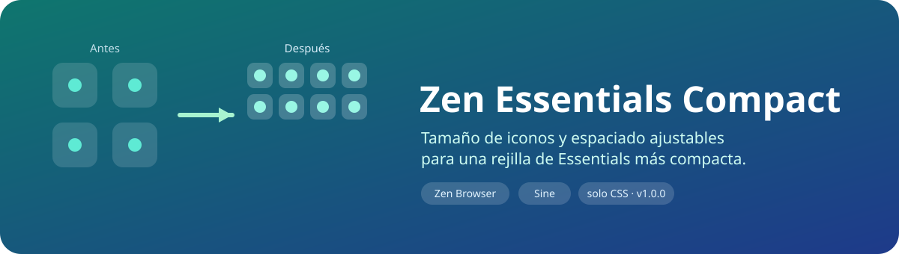
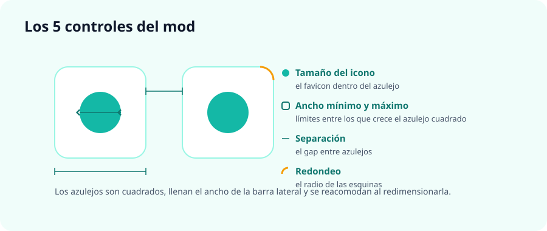

<div align="center">



# Zen Essentials Compact

**Rejilla compacta de Essentials: azulejos cuadrados que ocupan todo el ancho de la barra lateral y se reacomodan al redimensionarla.**


</div>

---

## ✨ ¿Qué hace?

Si vas agregando muchos Essentials, la cuadrícula empieza a ocupar demasiado alto porque cada icono lleva bastante espacio a su alrededor. Este mod la vuelve **compacta y cuadrada**:

- Cada Essential es un **cuadrado real** (mismo ancho que alto), no un rectángulo alargado.
- Los azulejos **llenan todo el ancho** de la barra lateral.
- Al **ensanchar o angostar la barra lateral**, la rejilla **añade o quita columnas** sola y los azulejos se redimensionan con ella.
- Puedes **encoger el azulejo** y **ajustar el tamaño del icono**, así entran más iconos ocupando menos alto.

Es un mod **solo-CSS** (sin JavaScript) y todo se controla desde las preferencias del mod en **Sine** — no necesitas editar código.



## 🎛️ Controles

| Preferencia | Por defecto | Qué hace |
|---|---|---|
| **Tamaño del icono** | `20` | Tamaño del favicon dentro de cada Essential (px). |
| **Ancho mínimo del azulejo** | `40` | Lo más angosto que puede ser un azulejo (px). Es lo que decide **cuántas columnas caben** por fila: más pequeño → más columnas. |
| **Ancho máximo del azulejo** | `96` | Tope de crecimiento (px). Evita azulejos enormes cuando tienes pocos Essentials y la barra lateral muy ancha. |
| **Separación** | `4` | Espacio (gap) entre los azulejos (px). Es idéntico en horizontal y en vertical. |
| **Redondeo** | `10` | Radio de las esquinas del azulejo (px). |

> Los valores son solo números (sin `px`); el mod les añade la unidad automáticamente.
> El alto no se configura: sale siempre del ancho, porque el azulejo es cuadrado.

**Preset bien compacto:** icono `18`, ancho mínimo `34`, ancho máximo `64`, separación `3`, redondeo `9`.

> ⚠️ Deja el **tamaño del icono por debajo del ancho mínimo**; si lo superas, el icono se recorta contra el borde del azulejo.

---

## 📋 Requisitos

- **[Zen Browser](https://zen-browser.app/)** con la barra lateral vertical (la predeterminada).
- **[Sine](https://github.com/CosmoCreeper/Sine)**, el gestor de mods de Zen — necesario para el panel de preferencias.

## 🚀 Instalación

### Con Sine (recomendada)

1. En Zen abre **Ajustes → Sine Mods**.
2. En *Marketplace*, bajo **“or, add your own locally from a GitHub repo”**, pega este identificador en el campo de texto:
   ```
   piero-valles-maravi/zen-essentials-compact
   ```
3. Pulsa **Install**. El mod aparece en *Installed Mods* con sus 5 preferencias.

> También funciona pegando la URL completa (`https://github.com/piero-valles-maravi/zen-essentials-compact`).

### Sin Sine — `userChrome.css` (avanzado)

Funciona, pero **sin panel de preferencias**: los valores quedan fijos en los que trae el CSS.

1. En `about:config`, pon `toolkit.legacyUserProfileCustomizations.stylesheets` en `true`.
2. Copia el contenido de [`chrome.css`](chrome.css) al final de `<perfil de Zen>/chrome/userChrome.css` (créalo si no existe).
   > 💡 Encuentra tu perfil en `about:profiles` → *Root Directory*.
3. Reinicia Zen. Para cambiar tamaños, edita a mano los números del bloque `:root` (`--ec-tile-min`, `--ec-icon`, etc.).

> ⚠️ **No sirve** copiar la carpeta dentro de `chrome/sine-mods/`: Sine solo carga los mods registrados en su `mods.json`, así que una carpeta suelta ahí se ignora.

## 🔄 Actualización

Sine detecta versiones nuevas por la **fecha del último cambio del repositorio**, no por el número de versión.

- Con **Auto-Update** activado se actualiza solo.
- Si no, pulsa **Check for Updates** en *Installed Mods*.
- Si cambiaron las preferencias (como al pasar de 1.0.x a 1.1.0), **reinstala** el mod para que Sine registre las nuevas.

---

## 🖱️ Uso

Abre la configuración del mod en Sine y ajusta los 5 valores a tu gusto. Los cambios se aplican al instante; si no, reinicia Zen.

---

## 📝 Notas y compatibilidad

- Solo afecta a los **Essentials** (no a las pestañas fijadas normales ni a las comunes).
- Con la barra lateral **expandida** los Essentials se ven en cuadrícula. Con la barra **colapsada**, Zen los pone en una sola columna (comportamiento propio de Zen) y el mod los mantiene cuadrados.
- El mod neutraliza tres medidas nativas de Zen que deformaban el azulejo (`--tab-overflow-clip-margin`, `--tab-margin-block` y `--tab-min-height`) y sustituye el alto fijo por `aspect-ratio`, de ahí que el cuadrado se mantenga a cualquier ancho.
- **¿Usas también SuperPins?** Ese mod también puede modificar el ancho/gap de los Essentials. Si notas que algo se pisa, desactiva en SuperPins las opciones de *Essentials width / gap / grid*, o ajusta el espaciado solo desde uno de los dos mods.

---

## 👤 Autor · Licencia

Creado por **[@piero-valles-maravi](https://github.com/piero-valles-maravi)**.

Publicado bajo la licencia **[MIT](LICENSE)** — puedes usarlo, modificarlo y compartirlo libremente, conservando el aviso de copyright.
