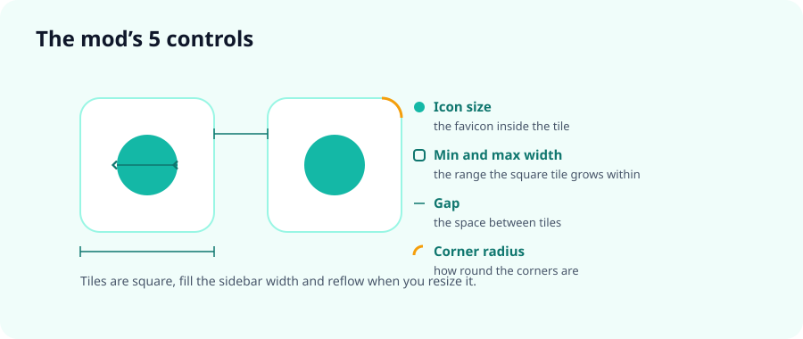

<div align="center">


# Zen Essentials Compact

**Square Essentials tiles that fill the sidebar width and reflow as you resize it.**

**Azulejos cuadrados que ocupan todo el ancho de la barra lateral y se reacomodan al redimensionarla.**


### [English](#english) · [Español](#español)

</div>

---

## English

### ✨ What it does

As you add more Essentials, the grid eats a lot of vertical space because every icon carries a wide margin around it. This mod makes that grid **compact and square**:

- Every Essential is a **real square** (same width as height), not a stretched rectangle.
- The tiles **fill the whole sidebar width**.
- When you **widen or narrow the sidebar**, the grid **adds or removes columns** by itself and the tiles resize with it.
- You can **shrink the tile** and **adjust the icon size**, so more icons fit in less height.

It is a **CSS-only** mod (no JavaScript) and everything is controlled from the mod's preferences in **Sine** — no code editing needed.



### 🎛️ Controls

| Preference | Default | What it does |
|---|---|---|
| **Icon size** | `20` | Size of the favicon inside each Essential (px). |
| **Min tile width** | `40` | The narrowest a tile may get (px). This is what decides **how many columns fit** per row: smaller → more columns. |
| **Max tile width** | `96` | Growth cap (px). Prevents huge tiles when you have few Essentials and a very wide sidebar. |
| **Gap** | `4` | Space between tiles (px). Identical horizontally and vertically. |
| **Corner radius** | `10` | Radius of the tile corners (px). |

> Values are plain numbers (no `px`); the mod appends the unit for you.
> Height is not configurable: it always follows the width, because the tile is square.

**Nice and compact preset:** icon `18`, min width `34`, max width `64`, gap `3`, radius `9`.

> ⚠️ Keep the **icon size below the min tile width**; above it, the icon gets clipped by the tile edge.

### 📋 Requirements

- **[Zen Browser](https://zen-browser.app/)** with the vertical sidebar (the default one).
- **[Sine](https://github.com/CosmoCreeper/Sine)**, the Zen mod manager — required for the preferences panel.

### 🚀 Installation

#### With Sine (recommended)

1. In Zen open **Settings → Sine Mods**.
2. Under *Marketplace*, in the **"or, add your own locally from a GitHub repo"** field, paste this identifier:
   ```
   piero-valles-maravi/zen-essentials-compact
   ```
3. Click **Install**. The mod shows up under *Installed Mods* with its 5 preferences.

> Pasting the full URL works too (`https://github.com/piero-valles-maravi/zen-essentials-compact`).

#### Without Sine — `userChrome.css` (advanced)

It works, but **without a preferences panel**: the values stay at whatever the CSS ships with.

1. In `about:config`, set `toolkit.legacyUserProfileCustomizations.stylesheets` to `true`.
2. Copy the contents of [`chrome.css`](chrome.css) to the end of `<Zen profile>/chrome/userChrome.css` (create the file if it doesn't exist).
   > 💡 Find your profile in `about:profiles` → *Root Directory*.
3. Restart Zen. To change sizes, edit the numbers in the `:root` block by hand (`--ec-tile-min`, `--ec-icon`, etc.).

> ⚠️ Dropping the folder into `chrome/sine-mods/` **does not work**: Sine only loads mods registered in its `mods.json`, so a loose folder there is ignored.

### 🔄 Updating

Sine detects new versions by the **repository's last-change date**, not by the version number.

- With **Auto-Update** on, it updates by itself.
- Otherwise, click **Check for Updates** under *Installed Mods*.
- If the preferences changed (as in the 1.0.x → 1.1.0 jump), **reinstall** the mod so Sine registers the new ones.

### 🖱️ Usage

Open the mod settings in Sine and tune the 5 values. Changes apply immediately; if they don't, restart Zen.

### 📝 Notes and compatibility

- It only affects **Essentials** (not regular pinned tabs, not normal tabs).
- With the sidebar **expanded** the Essentials show as a grid. With the sidebar **collapsed**, Zen puts them in a single column (Zen's own behavior) and the mod keeps them square.
- The mod neutralizes three native Zen measurements that were deforming the tile (`--tab-overflow-clip-margin`, `--tab-margin-block` and `--tab-min-height`) and replaces the fixed height with `aspect-ratio`, which is why the square holds at any width.
- **Also using SuperPins?** That mod can change the width/gap of Essentials too. If something clashes, turn off SuperPins' *Essentials width / gap / grid* options, or handle spacing from only one of the two mods.

### 👤 Author · License

Created by **[@piero-valles-maravi](https://github.com/piero-valles-maravi)**.

Released under the **[MIT](LICENSE)** license — use it, modify it and share it freely, keeping the copyright notice.

---

## Español

### ✨ ¿Qué hace?

Si vas agregando muchos Essentials, la cuadrícula empieza a ocupar demasiado alto porque cada icono lleva bastante espacio a su alrededor. Este mod la vuelve **compacta y cuadrada**:

- Cada Essential es un **cuadrado real** (mismo ancho que alto), no un rectángulo alargado.
- Los azulejos **llenan todo el ancho** de la barra lateral.
- Al **ensanchar o angostar la barra lateral**, la rejilla **añade o quita columnas** sola y los azulejos se redimensionan con ella.
- Puedes **encoger el azulejo** y **ajustar el tamaño del icono**, así entran más iconos ocupando menos alto.

Es un mod **solo-CSS** (sin JavaScript) y todo se controla desde las preferencias del mod en **Sine** — no necesitas editar código.


### 🎛️ Controles

| Preferencia | Por defecto | Qué hace |
|---|---|---|
| **Tamaño del icono** | `20` | Tamaño del favicon dentro de cada Essential (px). |
| **Ancho mínimo del azulejo** | `40` | Lo más angosto que puede ser un azulejo (px). Es lo que decide **cuántas columnas caben** por fila: más pequeño → más columnas. |
| **Ancho máximo del azulejo** | `96` | Tope de crecimiento (px). Evita azulejos enormes cuando tienes pocos Essentials y la barra lateral muy ancha. |
| **Separación** | `4` | Espacio (gap) entre los azulejos (px). Es idéntico en horizontal y en vertical. |
| **Redondeo** | `10` | Radio de las esquinas del azulejo (px). |

> Los valores son solo números (sin `px`); el mod les añade la unidad automáticamente.
> El alto no se configura: sale siempre del ancho, porque el azulejo es cuadrado.

**Preset bien compacto:** icono `18`, ancho mínimo `34`, ancho máximo `64`, separación `3`, redondeo `9`.

> ⚠️ Deja el **tamaño del icono por debajo del ancho mínimo**; si lo superas, el icono se recorta contra el borde del azulejo.

### 📋 Requisitos

- **[Zen Browser](https://zen-browser.app/)** con la barra lateral vertical (la predeterminada).
- **[Sine](https://github.com/CosmoCreeper/Sine)**, el gestor de mods de Zen — necesario para el panel de preferencias.

### 🚀 Instalación

#### Con Sine (recomendada)

1. En Zen abre **Ajustes → Sine Mods**.
2. En *Marketplace*, bajo **"or, add your own locally from a GitHub repo"**, pega este identificador en el campo de texto:
   ```
   piero-valles-maravi/zen-essentials-compact
   ```
3. Pulsa **Install**. El mod aparece en *Installed Mods* con sus 5 preferencias.

> También funciona pegando la URL completa (`https://github.com/piero-valles-maravi/zen-essentials-compact`).

#### Sin Sine — `userChrome.css` (avanzado)

Funciona, pero **sin panel de preferencias**: los valores quedan fijos en los que trae el CSS.

1. En `about:config`, pon `toolkit.legacyUserProfileCustomizations.stylesheets` en `true`.
2. Copia el contenido de [`chrome.css`](chrome.css) al final de `<perfil de Zen>/chrome/userChrome.css` (créalo si no existe).
   > 💡 Encuentra tu perfil en `about:profiles` → *Root Directory*.
3. Reinicia Zen. Para cambiar tamaños, edita a mano los números del bloque `:root` (`--ec-tile-min`, `--ec-icon`, etc.).

> ⚠️ **No sirve** copiar la carpeta dentro de `chrome/sine-mods/`: Sine solo carga los mods registrados en su `mods.json`, así que una carpeta suelta ahí se ignora.

### 🔄 Actualización

Sine detecta versiones nuevas por la **fecha del último cambio del repositorio**, no por el número de versión.

- Con **Auto-Update** activado se actualiza solo.
- Si no, pulsa **Check for Updates** en *Installed Mods*.
- Si cambiaron las preferencias (como al pasar de 1.0.x a 1.1.0), **reinstala** el mod para que Sine registre las nuevas.

### 🖱️ Uso

Abre la configuración del mod en Sine y ajusta los 5 valores a tu gusto. Los cambios se aplican al instante; si no, reinicia Zen.

### 📝 Notas y compatibilidad

- Solo afecta a los **Essentials** (no a las pestañas fijadas normales ni a las comunes).
- Con la barra lateral **expandida** los Essentials se ven en cuadrícula. Con la barra **colapsada**, Zen los pone en una sola columna (comportamiento propio de Zen) y el mod los mantiene cuadrados.
- El mod neutraliza tres medidas nativas de Zen que deformaban el azulejo (`--tab-overflow-clip-margin`, `--tab-margin-block` y `--tab-min-height`) y sustituye el alto fijo por `aspect-ratio`, de ahí que el cuadrado se mantenga a cualquier ancho.
- **¿Usas también SuperPins?** Ese mod también puede modificar el ancho/gap de los Essentials. Si notas que algo se pisa, desactiva en SuperPins las opciones de *Essentials width / gap / grid*, o ajusta el espaciado solo desde uno de los dos mods.

### 👤 Autor · Licencia

Creado por **[@piero-valles-maravi](https://github.com/piero-valles-maravi)**.

Publicado bajo la licencia **[MIT](LICENSE)** — puedes usarlo, modificarlo y compartirlo libremente, conservando el aviso de copyright.
